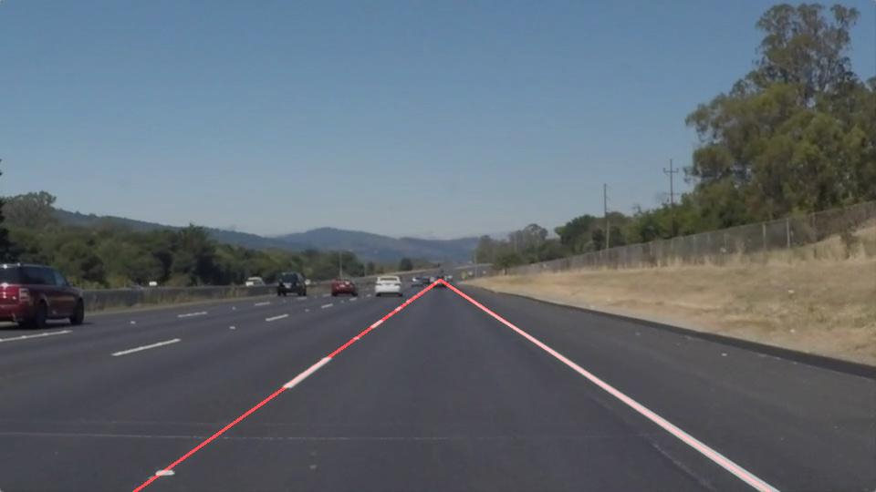

# Lane Detection
This post explains the pipeline for detecting lanes on a road.

## Pipeline
The pipeline for detecting lanes consists of the following steps
1. Convert color image to grey
2. Detect edges
3. Extract region of interest
3. Detect straight lines in edges
4. Average and extrapolate the lines
5. Draw the lines on the image

### 1. Convert color image to grey
Since the final goal of this project is to draw the detected lines on the original image, the image is read as an RGB image and a copy of it is made to be used for plotting. 
The RGB image is then converted to a gray image. This operation is usually an averaging along the channel dimension. OpenCV is used for this purpose.

### 2.Detect edges
Detecting edges boils down to computing the gradient of the image. Since the gradient is a continuous operation, it is discretised using finite elements.
The gradient is susceptible to noise in the image, as they are the high frequencies in the image. To overcome this, the image is smoothed using a Gaussian filter. A `$5 \times 5$` kernel was used to remove noise before computing the gradient.
Canny edge detection was used to compute the gradient of the image. The gradient intensity was thresholded to be between the `low_threshold=50` and the `high_threshold=150`.

### 3. Extract Region of Interest
The lanes are most probably in the region as shown in the figure below.

This prior knowledge is used to filter out the edges in the rest of the image.

### 4. Detect straight lines in edges
The edges belonging to a straight line are the lanes, as seen in the figure below.

To detect these straight lines, Hough transform is used. Hough transform transforms the image from the Cartesian space to Hough space. For example, a line `$y = mx+c$` in Cartesian space has variables `$x, y$`, but in Hough space has variables `$m, c$`. This results in the following
- Lines in Cartesian space are points in Hough space and vice versa.
- Intersection of a set of lines in Cartesian space is a set of colinear points in Hough space and vice versa.

This idea is used to detect a set of colinear points in Cartesian space (edges in discrete image -> set of colinear points) by detecting the intersection of lines in Hough space.
To detect the intersection of lines in Hough space, the Hough space is divided into many bins and histogram of these bins is analysed to detect possible locations of intersection.

P.S. Instead of using Cartesian space, polar space is used.

The division of the polar space into bins is done with the resolution of `$\rho=6, \theta=\\frac{pi}{60}$`. A threshold of 60, implying that atleast this many of votes the histogram needs to have to qualify as an intersection. The minimum line length and the maximum line gap are set to 45 and 15 respectively.

### 4. Average and extrapolate the lines
The detected lines are divided into two groups. The left group if the slope of the line is negative and the right group if not. In each group, a linear regression with L2 regularization is done to fit a line. The intersection of these two lines is calculated, in order to draw the lines from the bottom border till this point of intersection.

### 5. Draw the lines on the image
The resulting lines are drawn on the original RGB image. 

## Shortcomings
There are various shortcomings to this approach.
- This method is highly engineered. The parameters of the methods used, such as the low and high Canny thresholds as well as the Hough lines parameters, can effect the end result by a lot.
- Since straight lines are being detected by the Hough transform, this method is not reliable when the road is not straight.
- This method can be unreliable in other weather conditions such as rainy weather and under different illumination conditions such as during the night.

## Suggetions for possible improvements
- Supervised learning methods can be used to automatically detect the lanes. But, it requires labelled data.
- Higher order polynomial curves, such as quadratic can be used with regularization to detect curves.
- Different use cases for each possible case need to be engineered.